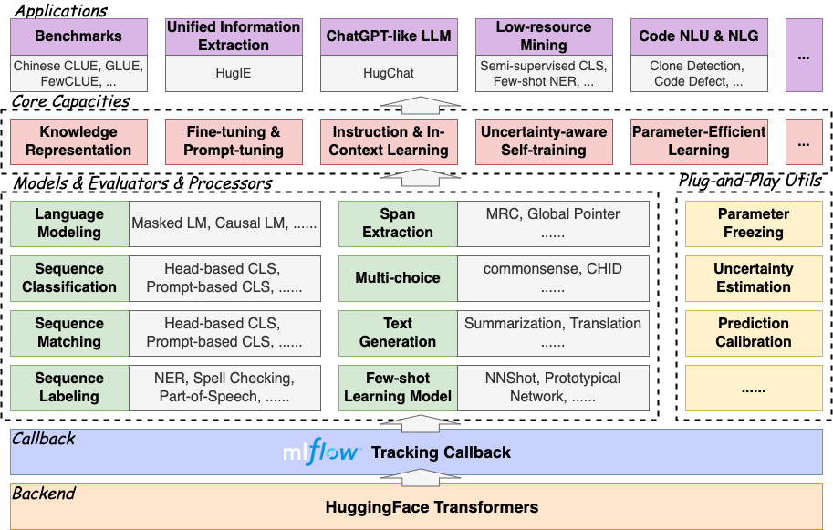

<p align="center">
    <br>
    
    <br>
<p>
    
<p align="center" style="font-size:22px;"> <b> Welcome to use HugNLP. 🤗 Hugging for NLP!

# About HugNLP

HugNLP is a novel development and application library based on [HuggingFace](https://huggingface.co/) for improving the convenience and effectiveness of NLP researches.

# Capability System


# Architecture

The framework overview is shown as follow:

<p align="center">
    <br>
    
    <br>
<p>

### Models


### Processors


### Application


### Trainer

# Quick Use

下载代码
推荐使用vscode
修改.vscode/sftp.json配置信息，修改服务器地址和密码，实现文件传输


# Quick Develop


# Demo API 

## HugIE：基于MRC的Instruction-tuning的统一信息抽取框架
基本思想和优势：
- 构建Instruction模板，将实体识别和事件抽取统一为MRC形式；
- 采用Global Pointer训练抽取器；
- 只需少量代码即可实现事件抽取，获取实体名称，事件信息。

快速使用：

```python
from applications.information_extraction.HugIE.api_test import HugIEAPI
model_type = 'bert'
hugie_model_name_or_path = 'wjn1996/wjn1996-hugnlp-hugie-large-zh'
hugie = HugIEAPI('bert', hugie_model_name_or_path)
text = "央广网北京2月23日消息 据中国地震台网正式测定，2月23日8时37分在塔吉克斯坦发生7.2级地震，震源深度10公里，震中位于北纬37.98度，东经73.29度，距我国边境线最近约82公里，地震造成新疆喀什等地震感强烈。"

entity = "塔吉克斯坦地震"
relation = "震源位置"
predictions, topk_predictions = hugie.request(text, entity, relation=relation)
print("entity:{}, relation:{}".format(entity, relation))
print("predictions:\n{}".format(predictions))
print("topk_predictions:\n{}".format(predictions))
print("\n\n")

"""
# 实体识别输出结果：
entity:塔吉克斯坦地震, relation:震源位置
predictions:
{0: ['10公里', '距我国边境线最近约82公里', '北纬37.98度，东经73.29度', '北纬37.98度，东经73.29度，距我国边境线最近约82公里']}
topk_predictions:
{0: [{'answer': '10公里', 'prob': 0.9895901083946228, 'pos': [(80, 84)]}, {'answer': '距我国边境线最近约82公里', 'prob': 0.8584909439086914, 'pos': [(107, 120)]}, {'answer': '北纬37.98度，东经73.29度', 'prob': 0.7202121615409851, 'pos': [(89, 106)]}, {'answer': '北纬37.98度，东经73.29度，距我国边境线最近约82公里', 'prob': 0.11628123372793198, 'pos': [(89, 120)]}]}
"""


entity = "塔吉克斯坦地震"
relation = "时间"
predictions, topk_predictions = hugie.request(text, entity, relation=relation)
print("entity:{}, relation:{}".format(entity, relation))
print("predictions:\n{}".format(predictions))
print("topk_predictions:\n{}".format(predictions))
print("\n\n")

"""
# 事件信息输出结果：
entity:塔吉克斯坦地震, relation:时间
predictions:
{0: ['2月23日8时37分']}
topk_predictions:
{0: [{'answer': '2月23日8时37分', 'prob': 0.9999995231628418, 'pos': [(49, 59)]}]}
"""
```


# Contact


# References
