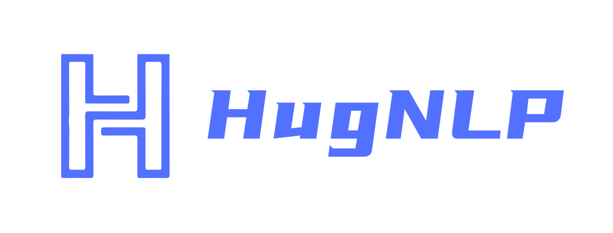
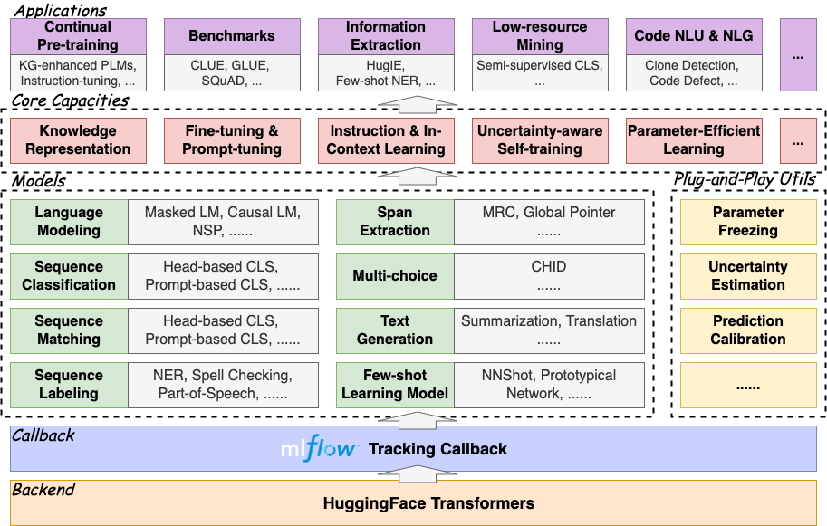
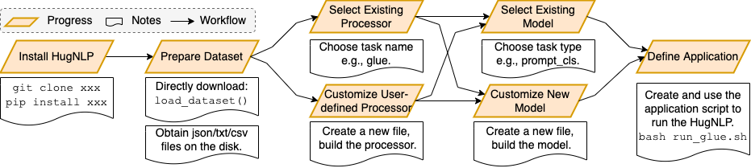
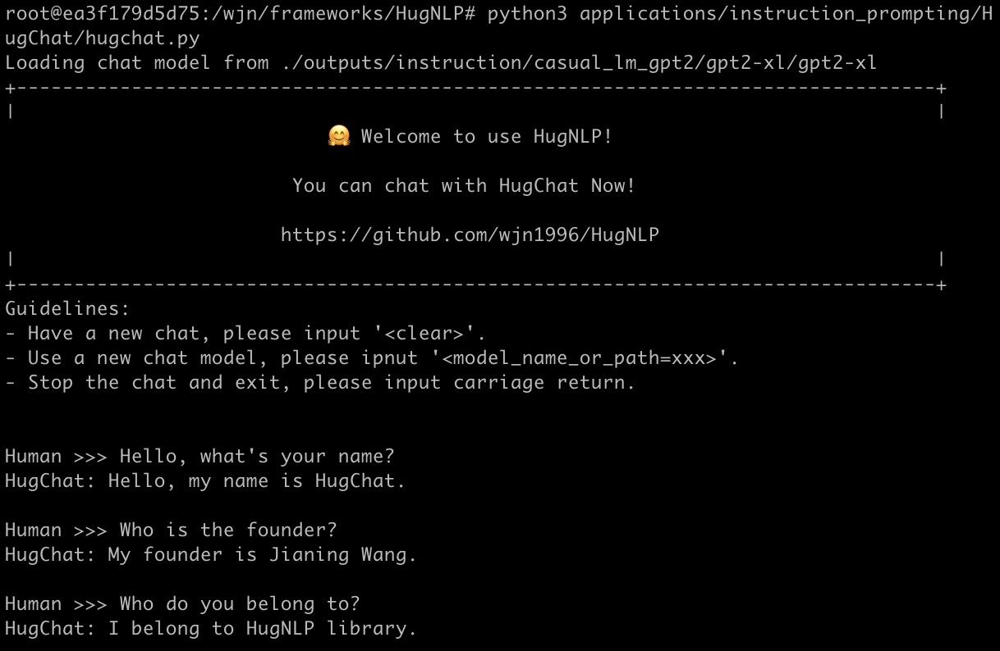
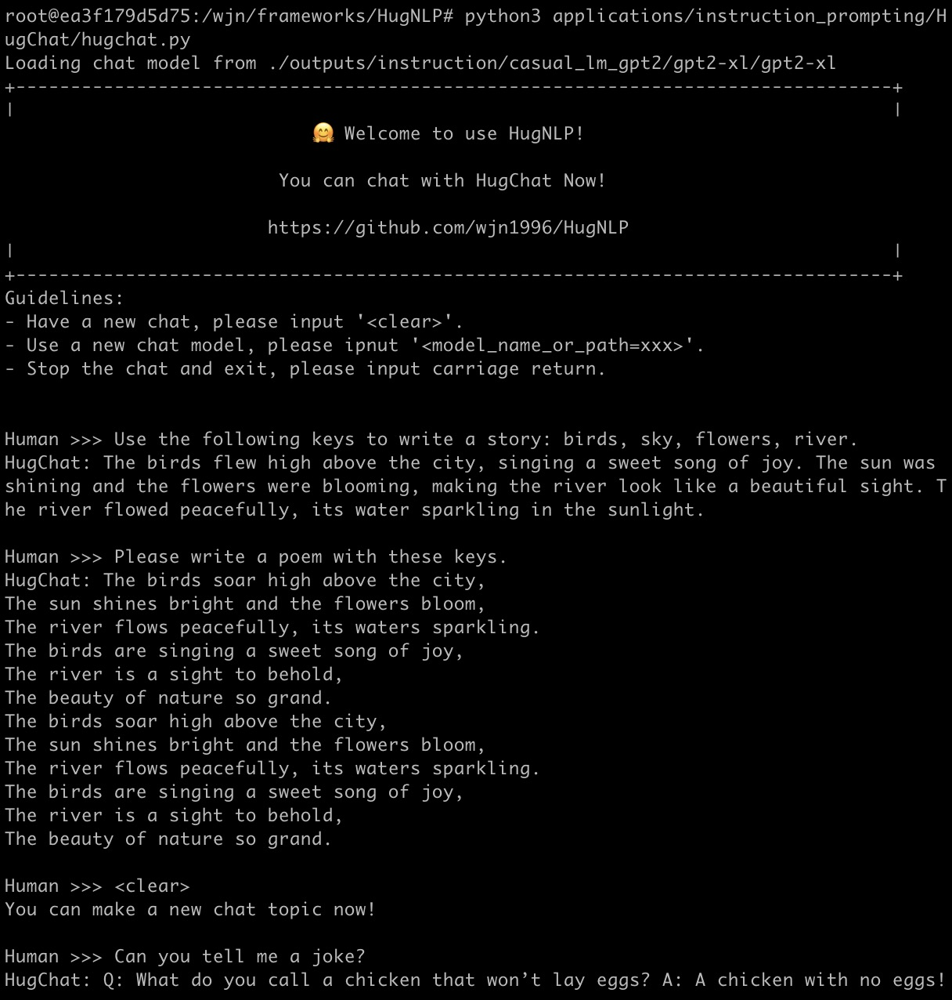
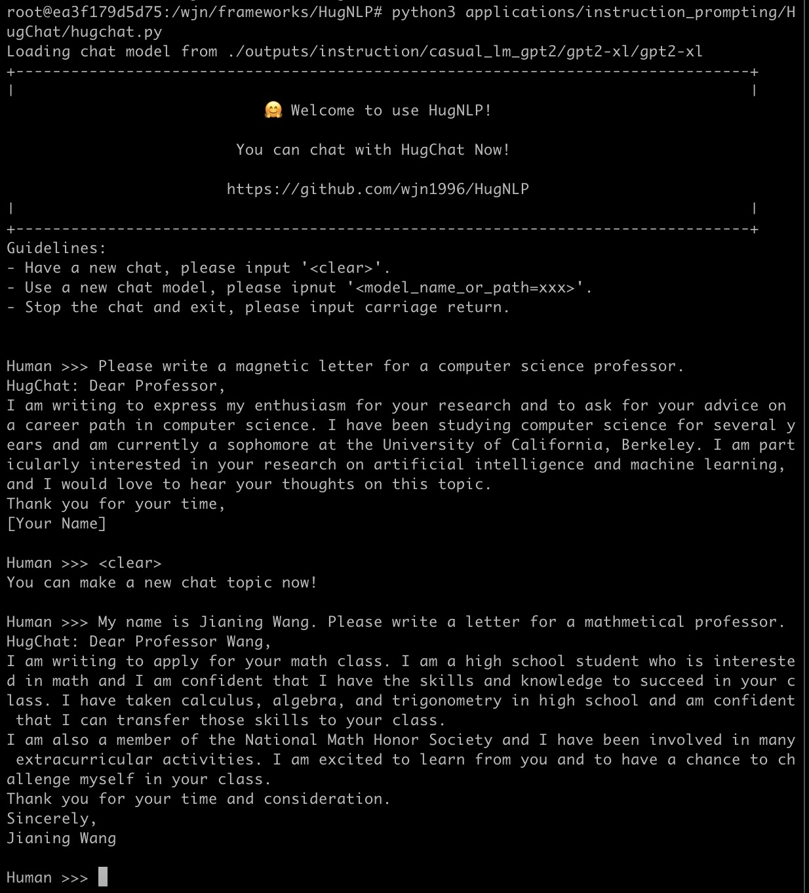
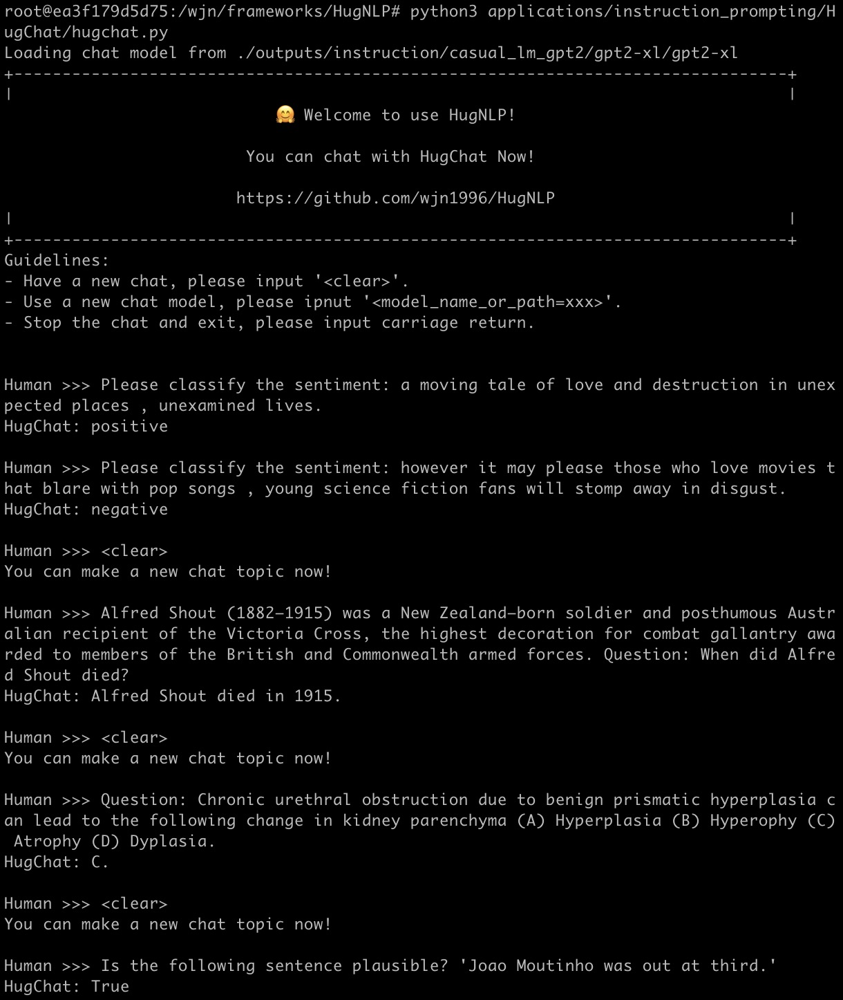
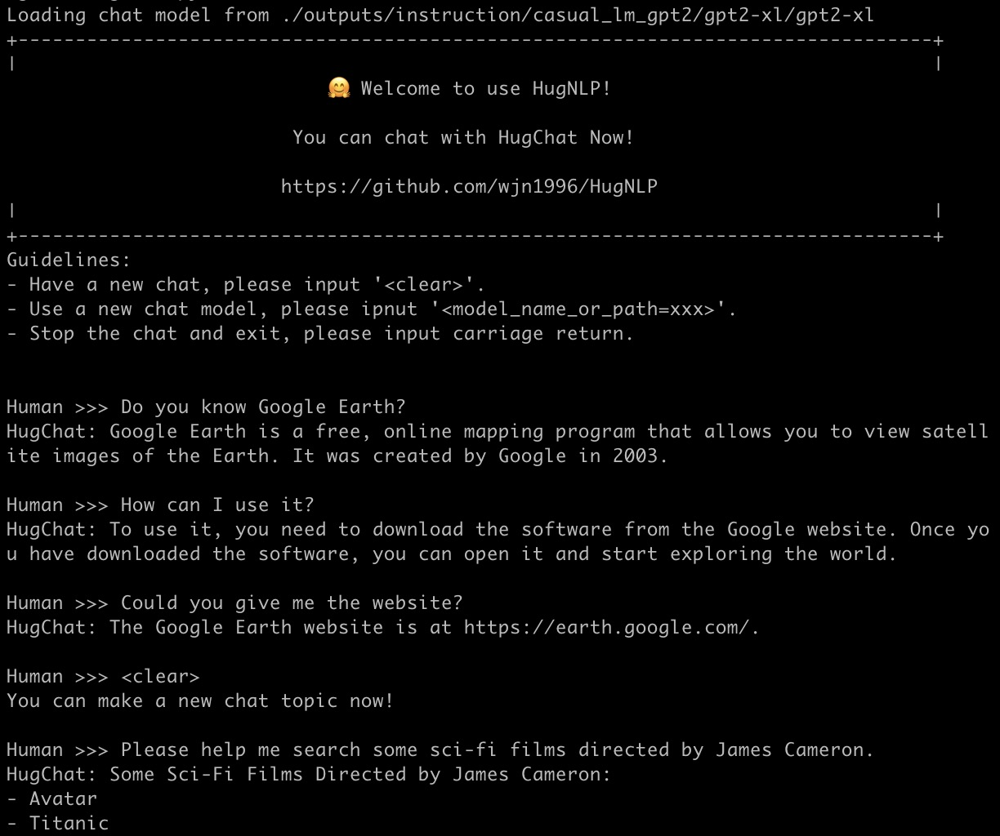
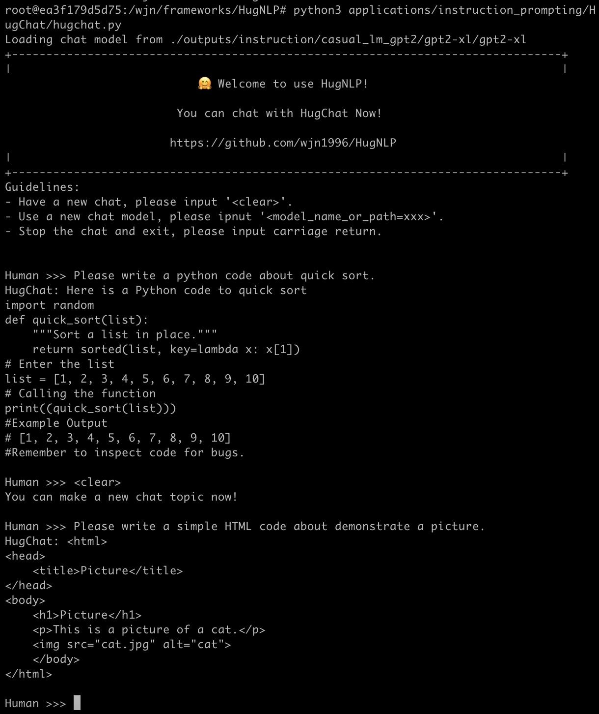

<p align="center">
    <br>
    
    <br>
</p>
<p align="center" style="font-size:22px;"> <b> 欢迎使用HugNLP！🤗 拥抱NLP! </b>
</p>


<div align="center">

[](https://dl.circleci.com/status-badge/redirect/gh/HugAILab/HugNLP/tree/main)
[](https://github.com/HugAILab/HugNLP/pull/)
[](http://makeapullrequest.com)
[](https://arxiv.org/abs/2302.14286)
[[英文](./README.md)]
    
</div>

# 关于HugNLP

HugNLP是一个基于[Hugging Face](https://huggingface.co/)开发的全面统一的NLP开源框架。
<!-- The founder and main developer is [Jianing Wang](https://wjn1996.github.io/). The collaborators are [Nuo Chen](https://github.com/nchen909), [Qiushi Sun](https://github.com/QiushiSun) and . -->

## **最新消息

- 🆕 [23-05-05]: HugNLP已发布于@HugAILab !
- 🆕 [23-04-06]: 类ChatGPT聊天助手HugChat上线! 欢迎与HugChat聊天! [[文档](./documents/instruction_prompting/generative_instruction_tuning.md)]
- 🆕 [23-04-02]: 增加GPT风格的指令调优。可持续训练一个小规模的ChatGPT! [[文档](./documents/instruction_prompting/generative_instruction_tuning.md)]
- 🆕 [23-03-21]: 完成序列分类的GPT-style情景学习。 [[文档](./documents/instruction_prompting/incontext_learning_for_cls.md)]
- 🆕 [23-03-13]: 增加代码克隆检测和缺陷检测任务。用户可自定义数据集用来训练。 [[文档](./documents/code/code_classification.md)]
- 🆕 [23-03-03]: 添加HugIE API和相应的训练脚本。你可以用它对中文数据进行信息抽取。 [[文档](./documents/information_extraction/HugIE.md)]
- 🆕 [23-02-18]: HugNLP项目已开源！

# 架构

HugNLP框架概览如下：

<p align="center">
    <br>
    
    <br>
<p>
### 模型（Models）

在HugNLP中，我们提供了一些流行的基于transformer的模型作为骨干，如BERT、RoBERTa、GPT-2等。我们还发布了KP-PLM，一种新颖的知识增强型预训练范式，可用于注入事实知识，并可轻松用于任意的PLM。
除了基本的PLMs，我们还实现了一些特定任务的模型，涉及序列分类、匹配、标注、词元抽取、多项选择和文本生成等。
我们同时开发了标准微调（基于分类头和提示调优模型），使PLM在分类任务上可调优。
对于小样本学习设置，HugNLP在小样本分类和命名实体识别（NER）方面都提供了一个原型网络。

此外，我们还在HugNLP中加入了一些即插即用的工具。

1. 参数冻结：如果我们想进行参数有效性学习，冻结PLM中的一些参数以提高训练效率，我们可以设置`use_freezing`，并冻结骨干模型。
2. 不确定性估计：目的是在半监督学习中计算模型的确定性。
3. 预测校准：可以通过校准分布及缓解语义偏差问题来进一步提高准确性。

### 处理器（Processors）

处理器旨在加载数据集，并在一个包含句子次元化、采样和张量生成的流水线中处理任务的examples。
用户也可以直接通过`load_dataset`获得数据，即可以从互联网上直接下载或从本地磁盘上加载。
对不同的任务，用户应该定义一个任务特定的数据整理器（data collator），其目的是将原始实例（examples）转化为模型输入张量features（特征）。

### 应用（Applications）

应用为用户提供了丰富的模块，通过在模型和处理器的一系列设置中进行选择，建立现实世界的应用和产品。

# 核心功能

我们提供一些核心能力来支持NLP的下游应用。

### 知识增强的预训练语言模型

传统的预训练方法缺乏事实性知识。
为了处理这个问题，我们提出了KP-PLM，它有一个新颖的知识提示范式，用于知识增强的预训练。
具体来说，我们通过识别实体为每个输入文本构建一个知识子图，并与知识库对齐，然后将这个子图分解为多个关系路径，这些关系路径可以直接转化为语言提示。

### 基于提示的微调

基于提示的微调旨在重用预训练目标任务（如掩码语言建模、因果语言建模），并利用设计好的template和verbalizer进行预测，这在低资源环境下颇有成效。
我们也将一些新方法整合到HugNLP中，如PET、P-Tuning等。

### 指令调优和情景学习

指令调优和情景学习可以在不更新参数的情况下进行小样本和零样本学习，其目的是将任务相关的指令或演示示例串联起来，促使GPT-style PLM产生可靠的反应。
因此，所有的NLP任务都可以被统一到相同的格式中，并大幅提高模型的泛化能力。
在该想法的启发下，我们把它扩展到其他几个范式：

1.抽取式范式：我们将各种NLP任务统一为词元抽取，这与抽取式问题回答相同。
2.推理式范式：所有的任务都可以被视为自然语言推理，以匹配输入和输出之间的关系。
3.生成式范式：我们将所有的任务统一为自然语言推理（NLI），并基于指令调优、情景学习或思维链来训练因果模型。

### 不确定性估计的自训练

自训练可以通过利用大规模的未标记数据来解决标记数据稀缺的问题，这也是半监督学习中的一个成熟范式。
然而，标准的自训练可能会产生过多的噪音，不可避免地会因为确认偏差而降低模型的性能。
因此，我们提出了不确定性感知的自训练。具体来说，我们在少数标签数据上训练教师模型，然后在贝叶斯神经网络（BNN）中使用蒙特卡洛（MC）dropout技术来近似估计模型的确定性，并选择教师模型确定性较高的例子。

### 参数有效性学习

为提高HugNLP的训练效率，我们还实现了参数有效性学习，其目的是将一些参数冻结在骨干网络中，这样我们在模型训练中只需调整少数参数。
我们开发了一些新的参数效率学习方法，如Prefix-tuning、Adapter-Tuning、BitFit和LoRA等。

# 安装

> git clone https://github.com/HugAILab/HugNLP.git
>
> cd HugNLP
>
> python3 setup.py install

目前，该项目仍在开发和改进中，使用过程中可能会有一些bugs，请谅解。我们也期待着你能提出issues或pull requests。

# 预建应用概览

我们在HugNLP中演示了所有预建的应用。你可以选择一个应用来使用HugNLP，也可以点击链接查看详细的文件。

| **应用**           | **运行任务**                  | **任务笔记**                                                 | **预训练模型**                          | **文档**                                                     |
| ------------------ | ----------------------------- | ------------------------------------------------------------ | --------------------------------------- | ------------------------------------------------------------ |
| **默认应用**       | run_seq_cls.sh                | **目标**: 用户自定义数据下序列分类的标准 **微调** 或 **提示调优**  <br> **路径**: applications/default_applications | BERT, RoBERTa, DeBERTa                  | [查看](./documents/default_tasks/default_sequence_classification.md) |
|                    | run_seq_labeling.sh           | **目标**: 用户自定义数据下序列标注的标准 **微调**  <br> **路径**: applications/default_applications | BERT, RoBERTa, ALBERT                   |                                                              |
| **预训练**         | run_pretrain_mlm.sh           | **目标**: 通过**掩码语言建模**(MLM)的预训练 <br> **路径**: applications/pretraining/ | BERT, RoBERTa                           | [查看](./documents/pretraining/Masked%20LM%20for%20Continual%20Pre-training.md) |
|                    | run_pretrain_casual_lm.sh     | **目标**: 通过**因果语言建模** (CLM)的预训练 <br> **路径**: applications/pretraining | BERT, RoBERTa                           | [查看](./documents/pretraining/Causal%20LM%20for%20Continual%20Pre-training.md) |
| **GLUE Benchmark** | run_glue.sh                   | **目标**: GLUE分类任务的标准 **微调** 或 **提示调优** <br> **路径**: applications/benchmark/glue | BERT, RoBERTa, DeBERTa                  |                                                              |
|                    | run_causal_incontext_glue.sh  | **目标**: GLUE分类任务的**上下文学习** <br> **路径**: applications/benchmark/glue | GPT-2                                   |                                                              |
| **CLUE Benchmark** | clue_finetune_dev.sh          | **目标**: GLUE分类任务的标准 **微调** 或 **提示调优**  <br> **路径**: applications/benchmark/clue | BERT, RoBERTa, DeBERTa                  |                                                              |
|                    | run_clue_cmrc.sh              | **目标**: CLUE CMRC2018任务的标准 **微调** <br> **路径**: applications/benchmark/cluemrc | BERT, RoBERTa, DeBERTa                  |                                                              |
|                    | run_clue_c3.sh                | **目标**: CLUE C3任务的标准 **微调** <br> **路径**: applications/benchmark/cluemrc | BERT, RoBERTa, DeBERTa                  |                                                              |
|                    | run_clue_chid.sh              | **目标**: CLUE CHID任务的标准 **微调**<br> **路径**: applications/benchmark/cluemrc | BERT, RoBERTa, DeBERTa                  |                                                              |
| **指令调优**       | run_causal_instruction.sh     | **目标**: 通过基于因果预训练模型的生成式指令调优进行**跨任务训练**. <font color='red'>**你可用来训练一个小型的ChatGPT**</font>. <br> **路径**: applications/instruction_prompting/instruction_tuning | GPT2                                    | [查看](./documents/instruction_prompting/generative_instruction_tuning.md) |
|                    | run_zh_extract_instruction.sh | **目标**: 通过基于Global Pointer模型的抽取式指令调优进行**跨任务训练** <br> **路径**: applications/instruction_prompting/chinese_instruction | BERT, RoBERTa, DeBERTa                  | [查看](./documents/instruction_prompting/extractive_instruction_tuning.md) |
|                    | run_causal_incontext_cls.sh   | **目标**: 用户自定义分类任务下的**上下文学习** <br> **路径**: applications/instruction_prompting/incontext_learning | GPT-2                                   | [查看](./documents/instruction_prompting/incontext_learning_for_cls.md) |
| **信息抽取**       | run_extractive_unified_ie.sh  | **目标**: **HugIE**: 通过抽取式指令调优训练一个统一的中文信息抽取应用. <br> **路径**: applications/information_extraction/HugIE | BERT, RoBERTa, DeBERTa                  | [查看](./documents/information_extraction/HugIE.md)          |
|                    | api_test.py                   | **目标**: HugIE: API测试. <br> **路径**: applications/information_extraction/HugIE | -                                       | [查看](./documents/information_extraction/HugIE.md)          |
|                    | run_fewnerd.sh                | **目标**: 用于命名实体识别的**原型学习**, 包括 SpanProto, TokenProto <br> **路径**: applications/information_extraction/fewshot_ner | BERT                                    |                                                              |
| **代码理解任务**   | run_clone_cls.sh              | **目标**: 用于代码克隆检测任务的标准**微调** <br> **路径**: applications/code/code_clone | CodeBERT, CodeT5, GraphCodeBERT, PLBART | [查看](./documents/code/code_classification.md)              |
|                    | run_defect_cls.sh             | **目标**: 用于缺陷检测任务的标准**微调** <br> **路径**: applications/code/code_defect | CodeBERT, CodeT5, GraphCodeBERT, PLBART | [查看](./documents/code/code_classification.md)              |

更多关于预建应用以及模型和处理器设置的细节可以在[HugNLP文档](./documents/README.md)中找到。

# 快速上手

这里我们提供一个例子来告诉你如何快速使用HugNLP。
如果你想在用户定义的数据集上执行分类任务，你可以在一个目录上准备三个json文件 (``train.json``, ``dev.json``, ``test.json``)，然后运行以下脚本文件

> bash ./application/default_applications/run_seq_cls.sh

在实验之前，你需要在脚本文件``run_seq_cls.sh``中定义以下参数。

- --model_name_or_path: 预训练的模型名称或路径，例如：bert-base-uncased。
- --data_path: 数据集的路径（包括`train.json`，`dev.json`和`test.json`），例如：`./datasets/data_example/cls/`。
- --user_defined: 如果没有`label_names.txt`，你需要定义标签名称。

如果你想进行基于提示的微调，你可以添加以下参数：

- --use_prompt_for_cls
- ---task_type: one of ``masked_prompt_cls``, ``masked_prompt_prefix_cls``,``masked_prompt_ptuning_cls``, ``masked_prompt_adapter_cls``.

你需要添加 ``template.json`` 和 ``label_words_mapping.json``文件.

如果你想使用参数有效性学习，你可以添加以下参数：

- --use_freezing

以``run_seq_cls.sh`` 为例:

```bash
path=chinese-macbert-base
MODEL_TYPE=bert
data_path=/wjn/frameworks/HugNLP/datasets/data_example/cls
TASK_TYPE=head_cls
len=196
bz=4
epoch=10
eval_step=50
wr_step=10
lr=1e-05

export CUDA_VISIBLE_DEVICES=0,1
python3 -m torch.distributed.launch --nproc_per_node=2 --master_port=6014 hugnlp_runner.py \
--model_name_or_path=$path \
--data_dir=$data_path \
--output_dir=./outputs/default/sequence_classification\
--seed=42 \
--exp_name=default-cls \
--max_seq_length=$len \
--max_eval_seq_length=$len \
--do_train \
--do_eval \
--do_predict \
--per_device_train_batch_size=$bz \
--per_device_eval_batch_size=4 \
--gradient_accumulation_steps=1 \
--evaluation_strategy=steps \
--learning_rate=$lr \
--num_train_epochs=$epoch \
--logging_steps=100000000 \
--eval_steps=$eval_step \
--save_steps=$eval_step \
--save_total_limit=1 \
--warmup_steps=$wr_step \
--load_best_model_at_end \
--report_to=none \
--task_name=default_cls \
--task_type=$TASK_TYPE \
--model_type=$MODEL_TYPE \
--metric_for_best_model=acc \
--pad_to_max_length=True \
--remove_unused_columns=False \
--overwrite_output_dir \
--fp16 \
--label_names=labels \
--keep_predict_labels \
--user_defined="label_names=entailment,neutral,contradiction"
```

# 快速开发

本节是为开发人员准备的。
HugNLP很容易使用和开发。我们在下图中画了一个工作流程，以显示如何开发一个新的运行任务。

<p align="center">
    <br>
    
    <br>
</p>
它含有五个主要步骤，包括库的安装、数据准备、处理器选择或设计、模型选择或设计以及应用设计。
这说明HugNLP可以简化复杂NLP模型和任务的实施。

# 预建产品

下面我们展示了两个预建API应用的例子。 

### HugChat： 面向生成式指令调优的类ChatGPT PLMs

HugChat是一个类ChatGPT的小模型，基于生成式指令调优，旨在将所有NLP任务统一为生成格式来训练因果语言模型（如GPT2、BART）。
你可以直接使用HugNLP来进行指令调优，并在用户定义的特定任务语料上持续训练一个小型的类ChatGPT模型。

你可以通过运行以下命令与HugChat聊天：
> python3 applications/instruction_prompting/HugChat/hugchat.py




<details><summary><b>1. 写故事</b></summary>



</details>

<details><summary><b>2. 写信</b></summary>



</details>

<details><summary><b>3. 计算</b></summary>


</details>

<details><summary><b>4. 自然语言理解 (情感, 阅读理解, KBQA)</b></summary>



</details>

<details><summary><b>5. 搜索</b></summary>



</details>

<details><summary><b>6. 写代码</b></summary>



</details>


祝玩得愉快！更多的细节可以在[这里](./documents/instruction_prompting/generative_instruction_tuning.md)找到。

### HugIE：通过抽取式MRC和指令调优的统一中文信息抽取应用

信息抽取（IE）旨在从非结构性文本中提取结构知识。结构知识是由""(head_entity, relation, tail_entity)""组成的三元组。IE由以下两个主要任务组成：

- 命名实体识别（NER）：旨在提取一种类型的所有实体。
- 关系抽取（RE）。它有两种目标，第一种目标是对两个实体之间的关系进行分类，第二种目标是在给定一个头实体和相应的关系时预测尾实体。

我们将NER和RE的任务统一到抽取式问题回答（即机器阅读理解）的范式中。
我们为NER和RE设计了特定任务的指令和语言提示。

> NER 任务:
>
> - instruction: "找到文章中所有【{entity_type}】类型的实体？文章：【{passage_text}】"
>
> RE 任务:
>
> - instruction: "找到文章中【{head_entity}】的【{relation}】？文章：【{passage_text}】"

在训练过程中，我们利用Global Pointer和Chines-Macbert作为基本模型。

我们的模型保存在Hugging Face中: [https://huggingface.co/wjn1996/wjn1996-hugnlp-hugie-large-zh](https://huggingface.co/wjn1996/wjn1996-hugnlp-hugie-large-zh).

快速使用HugIE进行中文信息抽取：

```python
from applications.information_extraction.HugIE.api_test import HugIEAPI
model_type = "bert"
hugie_model_name_or_path = "wjn1996/wjn1996-hugnlp-hugie-large-zh"
hugie = HugIEAPI("bert", hugie_model_name_or_path)
text = "央广网北京2月23日消息 据中国地震台网正式测定，2月23日8时37分在塔吉克斯坦发生7.2级地震，震源深度10公里，震中位于北纬37.98度，东经73.29度，距我国边境线最近约82公里，地震造成新疆喀什等地震感强烈。"

entity = "塔吉克斯坦地震"
relation = "震源位置"
predictions, topk_predictions = hugie.request(text, entity, relation=relation)
print("entity:{}, relation:{}".format(entity, relation))
print("predictions:\n{}".format(predictions))
print("topk_predictions:\n{}".format(predictions))
print("\n\n")

"""
# 事件信息输出结果：
entity:塔吉克斯坦地震, relation:震源位置
predictions:
{0: ["10公里", "距我国边境线最近约82公里", "北纬37.98度，东经73.29度", "北纬37.98度，东经73.29度，距我国边境线最近约82公里"]}
topk_predictions:
{0: [{"answer": "10公里", "prob": 0.9895901083946228, "pos": [(80, 84)]}, {"answer": "距我国边境线最近约82公里", "prob": 0.8584909439086914, "pos": [(107, 120)]}, {"answer": "北纬37.98度，东经73.29度", "prob": 0.7202121615409851, "pos": [(89, 106)]}, {"answer": "北纬37.98度，东经73.29度，距我国边境线最近约82公里", "prob": 0.11628123372793198, "pos": [(89, 120)]}]}
"""

entity = "塔吉克斯坦地震"
relation = "时间"
predictions, topk_predictions = hugie.request(text, entity, relation=relation)
print("entity:{}, relation:{}".format(entity, relation))
print("predictions:\n{}".format(predictions))
print("topk_predictions:\n{}".format(predictions))
print("\n\n")

"""
# 事件信息输出结果：
entity:塔吉克斯坦地震, relation:时间
predictions:
{0: ["2月23日8时37分"]}
topk_predictions:
{0: [{"answer": "2月23日8时37分", "prob": 0.9999995231628418, "pos": [(49, 59)]}]}
"""
```

# 贡献者

<a href="https://github.com/HugAILab/HugNLP/graphs/contributors">
  
</a>


# 联系我们

如果你有任何问题或建议，你可以加入钉钉小组：

<p align="center">
    <br>
    
    <br>
</p>

或直接联系作者 [`王嘉宁`](https://wjn1996.github.io).

# 引用

如果你觉得这个资源库有帮助，请引用我们的论文：

```latex
@misc{wang2023hugnlp,
  doi       = {10.48550/ARXIV.2302.14286},
  url       = {https://arxiv.org/abs/2302.14286},
  author    = {Jianing Wang, Nuo Chen, Qiushi Sun, Wenkang Huang, Chengyu Wang, Ming Gao},
  title     = {HugNLP: A Unified and Comprehensive Library for Natural Language Processing},
  year      = {2023}
}
```

# 参考文献

1. Jianing Wang, Nuo Chen, Qiushi Sun, Wenkang Huang, Chengyu Wang, Ming Gao:
HugNLP: A Unified and Comprehensive Library for Natural Language Processing. CoRR abs/2302.14286 (2023)
2. Jianing Wang, Wenkang Huang, Minghui Qiu, Qiuhui Shi, Hongbin Wang, Xiang Li, Ming Gao:
   Knowledge Prompting in Pre-trained Language Model for Natural Language Understanding. EMNLP 2022: 3164-3177
3. Chengyu Wang, Jianing Wang, Minghui Qiu, Jun Huang, Ming Gao: TransPrompt: Towards an Automatic Transferable Prompting Framework for Few-shot Text Classification. EMNLP 2021: 2792-2802
4. Jianing Wang, Chengyu Wang, Jun Huang, Ming Gao, Aoying Zhou: Uncertainty-aware Self-training for Low-resource Neural Sequence Labeling. AAAI 2023.

# 致谢

我们感谢阿里巴巴集团的人工智能平台（PAI）和蚂蚁集团对我们工作的支持。我们的合作框架是[EasyNLP]（https://github.com/alibaba/EasyNLP）。我们也感谢所有为我们的工作做出贡献的开发者!
