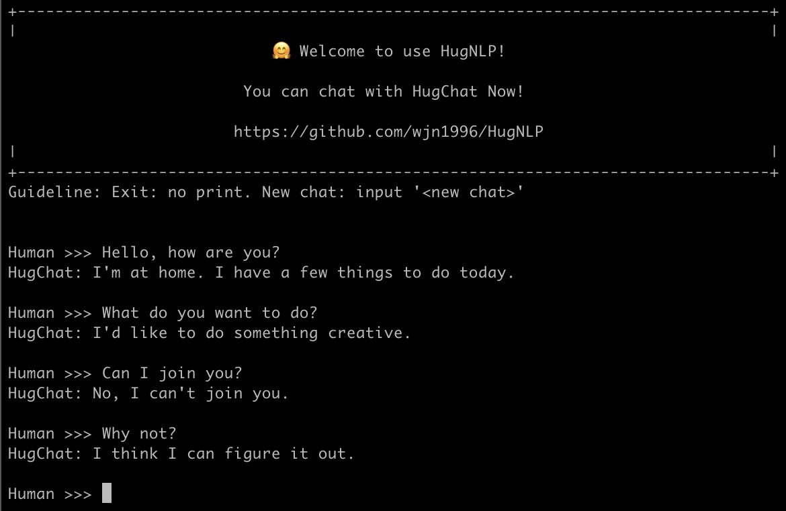

# Generative Instruction-tuning

Generative Instruction-tuning aims to unify all NLP task into generative format to train the causal language model (e.g., GPT2, BART).
Thus document teach you how to use HugNLP to perform instruction-tuning, and continual train a small ChatGPT-style model on user-defined task-specific corpora.

## HugChat

We develop the HugChat, you can make conversation on terminal:



You can run:
```bash
python3 applications/instruction_prompting/HugChat/hugchat.py
```

Have fun!

We will next provide introduction on how to train HugChat.

## Data Preparation

At first, you can prepare instruction corpora in ```instruction_corpora.json```. the format is shown in the following:
```json
{"text": "Human: Please classify the following sentiment. \n Sentiment: My girl friend likes this film, but I don' think so. \n HugChat: Negative. \n\n"},
```
We provide a small file in ```datasets/corpora/instruction/generative_instruction``` to demonstrate this format.

The corpora is released, you can obtain multiple data including:
- MedMCQA: [download](144.214.54.164:5000/MedMCQA.tar.gz)
- MedQA-USMLE: [download](144.214.54.164:5000/MedQA-USMLE.tar.gz)
- PubMedQA: [download](144.214.54.164:5000/PubMedQA.tar.gz)
- Alpaca: [download](https://github.com/tatsu-lab/stanford_alpaca/blob/main/alpaca_data.json)
- Belle_aplaca_cn: [download](https://huggingface.co/datasets/BelleGroup/train_1M_CN)
- Math Instruction: [download](https://huggingface.co/datasets/BelleGroup/school_math_0.25M)
- MultiTurn Chat: [download](https://huggingface.co/datasets/BelleGroup/multiturn_chat_0.8M)
- Prompt Generation: [download](https://huggingface.co/datasets/nomic-ai/gpt4all_prompt_generations_with_p3/tree/main)
- OIG: [download](https://huggingface.co/datasets/laion/OIG/tree/main)
- Others are coming soon ...

The first four dataset (MedMCQA, MedQA-USMLE, PubMedQA and Alpaca) can also be obtained from [LMFlow](https://github.com/OptimalScale/LMFlow).

We have collect these data and obtain 8M training examples (about 11GB). You can download it from [huggingface (
wjn1996/hugnlp-instruction-corpora)](https://huggingface.co/datasets/wjn1996/hugnlp-instruction-corpora), or run the following scripts:
```
cd datasets/corpora/instruction/generative_instruction
bash download_instruction_corpora.sh
```

## Running Application

We prepare a running script for training in ```./application/instruction_prompting/instruction_tuning/run_causal_instruction.sh```.

At first, you should edit the data_path as ```./datasets/corpora/instruction/generative_instruction``` in ```run_causal_instruction.sh``` at first.

You can also define some hyper-parameters, such as:
- learning_rate=2e-5
- per_device_train_batch_size=2
- per_device_eval_batch_size=1
- gradient_accumulation_steps=2
- ...

then run the script:

```bash
bash ./application/instruction_prompting/instruction_tuning/run_causal_instruction.sh
```

> If you select GPT-2 (large) and train on 8 V100 (32G) GPUs with 'per_device_train_batch_size=2, gradient_accumulation_steps=2, and epoch=10', The total training steps are 60K, the training time costs about 22 hours.

## Pre-built HugChat Modes

We design HugChat application based on generative instruction-tuning.
We have trained following models, and release the weights about HugChat:

| Backbone | Size | Progress | HuggingFace Model Link
| --- | --- | --- | --- |
| GPT-2 | base (0.3B) | Finish | [wjn1996/hugnlp-hugchat-gpt2](https://huggingface.co/wjn1996/hugnlp-hugchat-gpt2)
| GPT-2 | large (0.8B) | Developing |
| GPT-2 | xlarge (1.3B) | Developing |
| GPT-Neo | 2.7B | Pending |
| LLaMA | 7B | Pending |


## Demonstration:

We demonstrate the performance of conversations of GPT-2 (base) in the following.


```bash
>>> prompt = tokenizer("Input: Hello, how are you? ", return_tensors="pt")
>>> res = model.generate(input_ids=prompt["input_ids"], attention_mask=prompt["attention_mask"], max_length=len(prompt["input_ids"][0]) + 100, pad_token_id=tokenizer.eos_token_id, num_beams=3)
>>> tokenizer.decode(res[0])
'Input: Hello, how are you? \n Output: I am happy to answer your questions. \n\n'
```

```bash
>>> prompt = tokenizer("Input: Hello, how are you? \n Output: I am happy to answer your questions. \n Input: Where is Shanghai? ", return_tensors="pt")
>>> res = model.generate(input_ids=prompt["input_ids"], attention_mask=prompt["attention_mask"], max_length=len(prompt["input_ids"][0]) + 100, pad_token_id=tokenizer.eos_token_id, num_beams=3)
>>> tokenizer.decode(res[0])
'Input: Hello, how are you? \n Output: I am happy to answer your questions. \n Input: Where is Shanghai? \n Output: Shanghai is located in the southern part of the country. \n'
```

```bash
>>> prompt = tokenizer("Input: Hello, how are you? \n Output: I am happy to answer your questions. \n Input: Where is Shanghai? \n Output: Shanghai is located in the southern part of the country. \n Input: How many people there? ", return_tensors="pt")
>>> res = model.generate(input_ids=prompt["input_ids"], attention_mask=prompt["attention_mask"], max_length=len(prompt["input_ids"][0]) + 100, pad_token_id=tokenizer.eos_token_id, num_beams=3)
>>> tokenizer.decode(res[0])
'Input: Hello, how are you? \n Output: I am happy to answer your questions. \n Input: Where is Shanghai? \n Output: Shanghai is located in the southern part of the country. \n Input: How many people there? \n Output: There are approximately 20,000,000 people in Shanghai.'
```

We find the model can make a simple multi-turn conversations.

---

## 免责声明(Disclaimer)：

所使用的模型和数据均为开源资源，且当前训练的模型属于SFT(Supervised Fine-tuning)模型，可能存在如下缺陷：

- 在涉及事实性的指令上可能会产生违背事实的错误回答。

- 对于具备危害性的指令无法很好的鉴别，由此会产生危害性言论。

- 在一些涉及推理、代码等场景下模型的能力仍有待提高。

所开源的模型和技术方案仅供research，禁止商用，由于使用者恶意使用导致的法律道德诉讼等危害或风险，本框架团队概不负责。所有解释权归本框架团队所有。


The models and data used are all open source resources, and the currently trained model belongs to the SFT (Supervised Fine-tuning) model, which may have the following defects:

- There may be false answers to factual instructions.

- Inability to identify harmful instructions well, resulting in harmful remarks.

- The ability of the model in some scenarios involving reasoning, code, etc. still needs to be improved.

The open-source models and technical solutions are for research only, and commercial use is prohibited. The framework team is not responsible for any harm or risk such as legal and moral litigation caused by malicious use by users. All interpretation rights belong to the HugNLP framework team.

## Cite Me

```latex
@misc{wang2023hugnlp,
  doi       = {10.48550/ARXIV.2302.14286},
  url       = {https://arxiv.org/abs/2302.14286},
  author    = {Jianing Wang, Nuo Chen, Qiushi Sun, Wenkang Huang, Chengyu Wang, Ming Gao},
  title     = {HugNLP: A Unified and Comprehensive Library for Natural Language Processing},
  year      = {2023}
}
```
